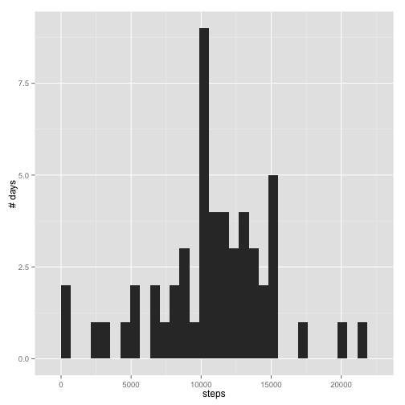

Reproducible Research: Peer Assessment 1
========================================================

# Part 1 - Loading and preprocessing the data

Code:

```r
#read in the data
activity <- read.csv("activity.csv",header=TRUE,na.strings="NA")

#format the data
#make steps numeric
activity$steps=as.numeric(activity$steps)
```

# Part 2 - What is mean total number of steps taken per day

## Run a histogram of steps and # days

Code:

```r
#eliminate missings
activity_rm <- na.omit(activity)

#transform to get steps by day
activity2 <- as.data.frame(aggregate(x=activity_rm$steps, by=list(activity_rm$date), 
                        FUN=sum))
colnames(activity2) <- c("date","steps")

#historgram of steps by # days
library(ggplot2)
qplot(steps,data=activity2,ylab="# days")
```

```
## stat_bin: binwidth defaulted to range/30. Use 'binwidth = x' to adjust this.
```

 

## Calculate the average (mean) steps per day

Code:

```r
mean(activity2$steps,na.rm=TRUE)
```

```
## [1] 10766
```

## Calculate the median steps per day

Code:

```r
median(activity2$steps,na.rm=TRUE)
```

```
## [1] 10765
```

# Part 3 - What is the average daily activity pattern?

## Make a time series plot of interval by avg num steps taken per day

Code:

```r
#transform to get steps by interval
activity_int <- as.data.frame(aggregate(x=activity_rm$steps, by=list(activity_rm$interval), 
                                     FUN=mean))
colnames(activity_int) <- c("interval","steps")

#time series plot of the 5-minute interval and avg steps taken across all days
with(activity_int,plot(interval,steps,type="l",main="Avg steps per interval",
                         xlab="Interval",
                        ylab="# steps"))
```

 

## Identify the interval with the max average steps

Code:

```r
max_int <- subset(activity_int,steps==max(steps))
max_int
```

```
##     interval steps
## 104      835 206.2
```

# Part 4 - Imputing missing values

## Calculate and report the total number of missing values

Code:

```r
missings <- subset(activity,is.na(activity$steps))
nrow(missings)
```

```
## [1] 2304
```

## Devise a strategy to impute missings

Choice was to use the mean across all intervals.  
Code:

```r
#calculate mean by interval and impute mean for missing values
mean_steps_int <- mean(activity_rm$steps,na.rm=TRUE)
missings_trf <- transform(missings,steps=mean_steps_int)
head(missings_trf)
```

```
##   steps       date interval
## 1 37.38 2012-10-01        0
## 2 37.38 2012-10-01        5
## 3 37.38 2012-10-01       10
## 4 37.38 2012-10-01       15
## 5 37.38 2012-10-01       20
## 6 37.38 2012-10-01       25
```

## Create a new dataset equal to orig but with missings imputed

```r
#bring missings and remaining rows back together
activity_imputed <- rbind(activity_rm,missings_trf)
nrow(activity_imputed)
```

```
## [1] 17568
```

## New histogram with imputed values

Code:

```r
activity3 <- as.data.frame(aggregate(x=activity_imputed$steps, by=list(activity_imputed$date), 
                                     FUN=sum))
colnames(activity3) <- c("date","steps")

#new with imputed historgram of steps by # days
library(ggplot2)
qplot(steps,data=activity3,ylab="# days")
```

```
## stat_bin: binwidth defaulted to range/30. Use 'binwidth = x' to adjust this.
```

 
  
  Comment on result: scale on the chart jumps from 7.5 to 12.5 when adding data which should be counted but for whatever reason was not tracked due to technology, user error, etc.

## New mean

Code:

```r
mean(activity3$steps,na.rm=TRUE)
```

```
## [1] 10766
```
Comment on result: remains the same since I used the mean to impute

## New median

Code:

```r
median(activity3$steps,na.rm=TRUE)
```

```
## [1] 10766
```
Comment on result: comes in line with the mean since that's what I imputed

# Part 5 - Difference in activity between weekdays and weekends

## Create a factor variable with two levels - weekday and weekend

Code:

```r
activity_imputed$date=as.Date(activity_imputed$date)
activity_imputed$weektime <- as.factor(ifelse(weekdays(activity_imputed$date) 
                                  %in% c("Saturday","Sunday"),"weekend", "weekday"))
head(activity_imputed)
```

```
##     steps       date interval weektime
## 289     0 2012-10-02        0  weekday
## 290     0 2012-10-02        5  weekday
## 291     0 2012-10-02       10  weekday
## 292     0 2012-10-02       15  weekday
## 293     0 2012-10-02       20  weekday
## 294     0 2012-10-02       25  weekday
```

## Make a panel plot of a time series of interval and steps per day by wkday/wkend

Code:

```r
#avg steps per interval split by wkdaywkend
activity_wkdaywkend_int <- as.data.frame(aggregate(x=activity_imputed$steps, 
                                                 by=list(activity_imputed$weektime,
                                                         activity_imputed$interval), 
                                                 FUN=mean))
colnames(activity_wkdaywkend_int) <- c("weektime","interval","steps")

#panel plot by wkday/wkend displaying steps per interval
library(lattice)
xyplot(steps~interval|weektime,data=activity_wkdaywkend_int, type='l',layout=c(1,2))
```

 
